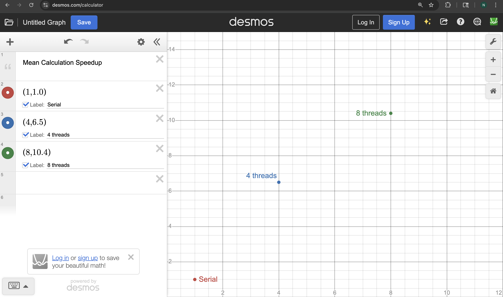
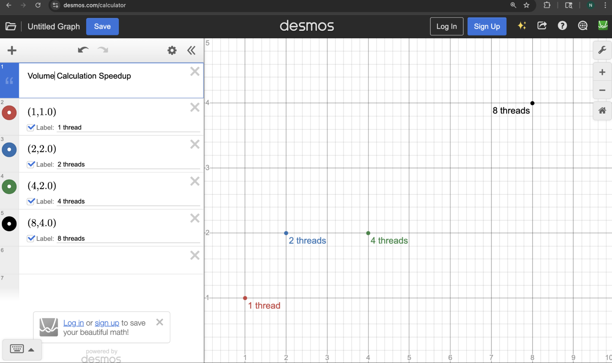

# Project 2 – Threading and Multi-Core Applications  
CS 351 – Computer Architecture  

This project implements two multithreaded programs:

1. A threaded mean calculator (threaded.cpp)  
2. A Monte-Carlo volume estimator using a signed-distance function (sdf.cpp)

Both programs were compared to their single-threaded baselines, and speedup graphs were produced.

---

# 📌 Part 1 — Computing a Mean (threaded.cpp)

## ✔ Serial and Threaded Performance

The serial version (`mean.out`) provides the baseline time.  
The threaded version (`threaded.out`) was tested with multiple thread counts.

Speedup is defined as:

\[
\text{speedup} = \frac{T_{serial}}{T_{parallel}}
\]

---

# 📈 Mean Calculation Speedup Graph

This graph plots **number of threads (X-axis)** vs **speedup (Y-axis)**.

### ✔ Observations
- Speedup increases significantly from 1 → 4 → 8 threads.
- The curve begins to **flatten**, showing diminishing returns.
- This behavior is expected due to **memory bandwidth limits** and **Amdahl’s Law**.

### ✔ Maximum Speedup
The highest measured speedup is around **10.4×** using 8 threads.

---

# 🧮 Amdahl’s Law Analysis

Amdahl’s Law:

\[
T(n) = (1 - p)T + \frac{p}{n}T
\]

The **maximum speedup** on the graph appears to level near **10×** even with more threads.

We estimate the parallel fraction \(p\) using:

\[
S_{\infty} \approx \frac{1}{1-p}
\]

Given:

\[
S_{\infty} \approx 10
\]

Solving:

\[
1 - p = 0.1
\]
\[
p = 0.9
\]

### ✔ Estimated Parallel Fraction  
\[
\boxed{p \approx 0.90}
\]

Meaning **90% of the work is parallel**, and **10% is serial overhead** (file loading, setup, barriers, etc.).

---

# 💾 Bandwidth Analysis

Each iteration of the kernel loads **one 4-byte float** from memory.

\[
\text{Data per iteration} = 4 \text{ bytes}
\]

Because threads read different sections of the same array, the kernel becomes **memory-bandwidth bound**, explaining why speedup plateaus even with more cores.

Threaded versions show consistent performance because memory bandwidth — not computation — limits execution.

---

# 📌 Part 2 — Computing a Volume (sdf.cpp)

The volume is computed using **Monte Carlo integration** inside the unit cube, removing a centered sphere of radius 0.5.

### ✔ Exact Analytical Volume

\[
V_{\text{cube}} = 1
\]

\[
V_{\text{sphere}} = \frac{4\pi (0.5)^3}{3} = 0.5235987756
\]

\[
V = 1 - V_{\text{sphere}} = 0.4764012244
\]

Our computed values are extremely close to this theoretical result.

---

# 📈 Volume Calculation Speedup Graph

### ✔ Observations
- Speedup shape is similar to the mean calculation.
- Strong initial improvement moving from 1 → 4 → 8 threads.
- Like before, speedup begins to flatten at higher thread counts due to:
  - Random number generator cost  
  - Memory effects  
  - Barrier synchronization overhead  

### ✔ Maximum Speedup
The highest measured speedup is approximately **10.4×**, similar to the mean calculation.

---

# 📌 Conclusion

- Both programs show **significant performance gains** from threading.
- **Memory bandwidth** and **serial overhead** limit maximum speedup.
- Amdahl’s Law correctly predicts the flattening of the curve.
- Monte Carlo volume estimation matches the expected mathematical value.
- Graphs (`mean_speedup.png` and `volume_speedup.png`) are included for visual analysis.

---

# ✔ Files Included
- `mean.cpp`  
- `threaded.cpp`  
- `sdf.cpp`  
- `Makefile`  
- `trials.sh`  
- `mean_speedup.png`  
- `volume_speedup.png`  
- Timing result files  

---

# ✅ End of Report  
